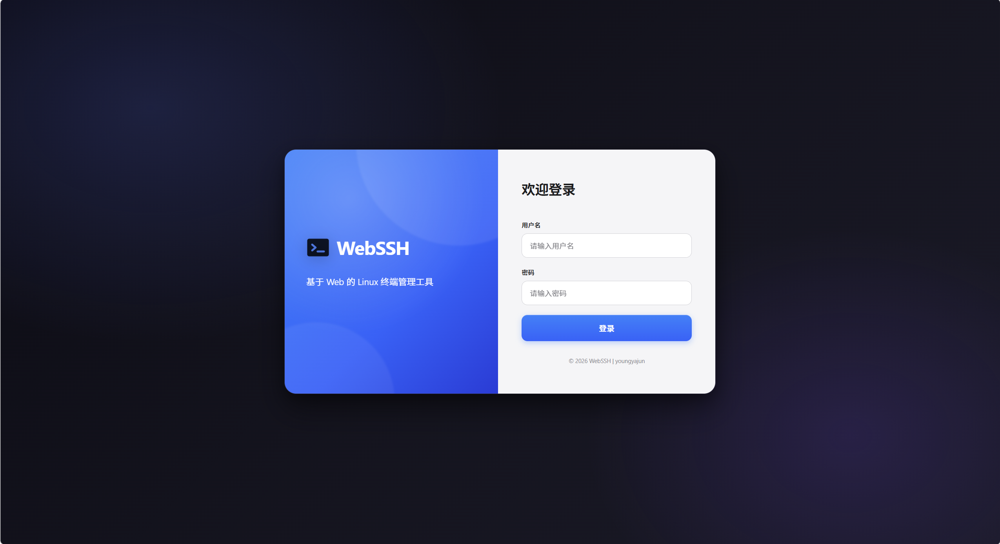
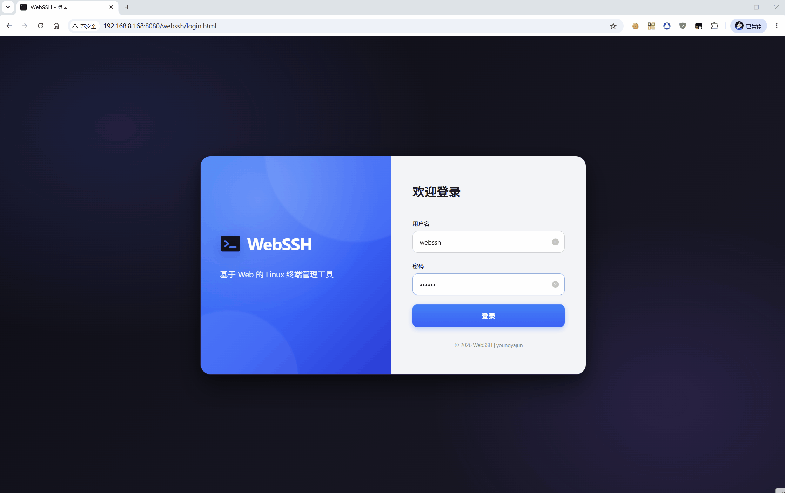

<h1 align="center">WebSSH</h1>

**基于Spring Boot的Web SSH终端解决方案**

- **双模部署**：支持作为`Spring Boot Starter`依赖嵌入现有项目，亦可独立部署运行。
- **极简接入**：引入依赖并简单配置，即可快速启用。
- **零客户端**：通过浏览器直接操作`Linux`服务器，无需安装任何额外软件。



# 1. 功能特性

- **Web 终端**：基于 `xterm.js` + `WebSocket`，完整终端体验（`vim`、`top`等全屏程序正常显示）
- **多标签页**：同时连接多台主机，标签页拖拽排序，独立会话互不影响
- **文件管理**：`SFTP` 浏览目录、上传/下载文件与目录（目录自动`tar`打包）、文本预览、查看属性
- **主题切换**：Dark / Light 双主题，终端、文件管理器、弹窗等全局联动（顶部导航栏固定暗色）
- **安全传输**：登录密码经 RSA 加密传输，私钥一次性使用，用后即焚
- **防暴力破解**：基于`IP`的登录失败计数与自动锁定
- **风险命令拦截**：正则匹配危险命令（如 `rm -rf /`），命中则拒绝执行
- **主机密钥校验**：支持严格校验（防中间人攻击）与免校验两种模式
- **认证方式**：密码认证与私钥认证（可选私钥口令）
- **终端自适应**：`PTY`尺寸随浏览器窗口实时同步，`vim`等程序启动即正确填充



# 2. 技术栈

| 层面       | 技术                           |
| ---------- | ------------------------------ |
| 后端       | Spring Boot 4.0.x、JDK 21      |
| SSH 客户端 | JSch（com.github.mwiede:jsch） |
| 通信       | WebSocket                      |
| 前端终端   | xterm.js 5.5.0                 |
| 构建       | Maven 多模块                   |

# 3. 项目结构

```
webssh/
├── pom.xml                          # 父 POM（依赖管理）
├── yyj-webssh-spring-boot-starter/  # Starter 模块（自动装配 + 前端资源）
│   └── src/main/
│       ├── java/com/webssh/
│       │   ├── config/              # 自动配置 & 属性类
│       │   ├── controller/          # 认证、文件管理、页面控制器
│       │   ├── security/            # 认证拦截器、登录安全策略
│       │   ├── ssh/                 # SSH 连接工厂、会话管理、服务层
│       │   ├── util/                # RSA 工具
│       │   └── websocket/           # WebSocket 配置与处理器
│       └── resources/META-INF/
│           ├── resources/webssh/    # 前端页面（HTML/CSS/JS/xterm）
│           └── spring/              # AutoConfiguration 注册文件
└── webssh-app/                      # 示例应用（可直接运行）
    └── src/main/
        ├── java/com/yyj/            # 启动类（启动后自动打开浏览器）
        └── resources/
            ├── application.yml      # 端口、上传限制等
            └── application-webssh.yml # WebSSH 配置
```

# 4. 快速开始

## 4.1 构建项目

```bash
# 在项目根目录执行（需 Java 21 + Maven）
mvn clean install -DskipTests
```

构建产物：
- `yyj-webssh-spring-boot-starter/target/yyj-webssh-spring-boot-starter-1.0.0.jar` — Starter 制品
- `webssh-app/target/webssh-app.jar` — 可直接运行的示例应用

## 4.2 运行示例应用

```bash
java -jar webssh-app/target/webssh-app.jar
```

启动后自动打开浏览器访问登录页，也可手动访问 `http://localhost:8080/webssh/login.html`。

## 4.3 接入已有 Spring Boot 项目

**步骤一：添加 Maven 依赖**

先在项目根 POM（或 `dependencyManagement`）中声明版本：

```xml
<dependencyManagement>
    <dependencies>
        <dependency>
            <groupId>com.yyj</groupId>
            <artifactId>yyj-webssh-spring-boot-starter</artifactId>
            <version>1.0.0</version>
        </dependency>
    </dependencies>
</dependencyManagement>
```

在子模块 POM 中引入依赖：

```xml
<dependency>
    <groupId>com.yyj</groupId>
    <artifactId>yyj-webssh-spring-boot-starter</artifactId>
</dependency>
```

> Starter 已包含 `spring-boot-starter-web` 和 `spring-boot-starter-websocket`，无需重复声明。

**步骤二：配置 `application-webssh.yml`**

```yaml
# WebSSH 配置
# ============================================================================
# 文件上传/下载大小限制说明
# ----------------------------------------------------------------------------
# 1. 上传（POST /webssh/api/upload）
#    - 受 Spring Boot 全局 multipart 配置约束，配置项位于 application.yml：
#        spring.servlet.multipart.max-file-size        单文件最大大小（默认 1MB）
#        spring.servlet.multipart.max-request-size     整个请求最大大小（默认 10MB）
#    - 超过限制会抛 MaxUploadSizeExceededException，前端收到 500 错误
#    - 若使用反向代理（如 Nginx），还需同步调整 client_max_body_size
#      以及 Tomcat 的 server.tomcat.max-swallow-size / max-http-form-post-size
#
# 2. 下载（GET /webssh/api/download）
#    - 代码层面无大小限制，采用 SFTP/tar 流式传输（4KB 缓冲区）
#    - 实际上限受 HTTP 超时、代理超时（proxy_read_timeout）等网络层约束
#
# 3. 文件预览（GET /webssh/api/preview）
#    - 硬编码 2MB 限制（WebSshFileController 中 maxSize = 2 * 1024 * 1024）
#    - 超过会提示“文件过大，不支持预览，请直接下载”，如需调整需改源码
# ============================================================================
webssh:
  # 是否启用（设为 false 则完全关闭 WebSSH）
  enabled: true
  # WebSSH 界面访问路径前缀
  context-path: /webssh
  # WebSSH 管理界面登录账号（必填，无默认值，启动时校验）
  username: your-account
  # WebSSH 管理界面登录密码（必填，无默认值，建议强密码）
  password: your-strong-password
  # SSH 连接超时（毫秒）
  timeout: 10000
  # 终端类型
  terminal-type: xterm-256color
  # 字符编码
  charset: UTF-8
  # 主机密钥校验：yes=严格校验（推荐生产环境），no=不校验（默认）
  host-key-verification: no
  # known_hosts 路径（host-key-verification=yes 时使用）
  # known-hosts: ~/.ssh/known_hosts

  # SSH 主机列表
  hosts:
    - name: 测试服务器
      host: 127.0.0.1
      port: 22
      username: root
      password: ssh-password
      
    - name: 生产服务器
      host: xxx.xxx.xxx.xxx
      port: 22
      # === （username&password）和 （privateKey&passphrase）可以二选一 ===
      # username: root									# 可以不配置username，登录后在界面手动输入
      # password: ssh-password							# 可以不配置password，登录后在界面手动输入
      
      # privateKey: /path/to/id_rsa
      # passphrase: private-key-password

  # 高风险命令正则列表（命中任意一条则拒绝通过终端执行）
  high-risk-commands:
    # === 文件系统破坏 ===
    - '^rm\s+-rf\s+/'                                   # rm -rf /  (删除根目录)
    - '^rm\s+-rf\s+/\*'                                 # rm -rf /* (删除根目录下所有文件)
    - '^rm\s+-rf\s+~'                                   # rm -rf ~  (删除家目录)
    - '>\s*/dev/sd[a-z]'                                # > /dev/sda (覆盖磁盘)
    - 'dd\s+if=.*of=/dev/'                              # dd 直接写磁盘
    - 'mkfs\.'                                          # mkfs.*    (格式化文件系统)
    # === 权限失控 ===
    - '^chmod\s+-R\s+777\s+/'                           # chmod -R 777 / (开放所有权限)
    - '^chown\s+-R\s+\w+:\w+\s+/'                       # chown -R 递归改所有者
    # === 系统关机/重启 ===
    - '^shutdown'                                       # shutdown
    - '^reboot'                                         # reboot
    - '^halt'                                           # halt
    - '^poweroff'                                       # poweroff
    - '^init\s+[06]'                                    # init 0 / init 6
    # === 进程与磁盘 ===
    - 'fdisk\s+/dev/'                                   # fdisk 磁盘分区
    - 'parted\s+/dev/'                                  # parted 磁盘分区

  # 登录安全策略（防暴力破解）
  login-security:
    max-fail-attempts: 5      							# 最大失败次数（0 或负数=关闭限制）
    lock-minutes: 5           							# 锁定时长（分钟）
    trust-forwarded-for: false 							# 是否信任 X-Forwarded-For（反代场景设为 true）
```

**步骤三：引入application-webssh.yml**

主配置application.yml文件引入配置：

```yml
# Spring 相关配置
spring:
  profiles:
    # 激活的配置文件（对应 application-webssh.yml）
    active: webssh
```

**步骤四：启动应用**

正常启动 Spring Boot 应用即可，Starter 通过 `AutoConfiguration.imports` 自动装配，无需额外注解或配置类。

访问 `http://your-host:port/webssh/login.html`，使用 `webssh.username` / `webssh.password` 登录后选择主机连接。

# 5. 配置项参考

| 配置项 | 默认值 | 说明 |
|--------|--------|------|
| `webssh.enabled` | `true` | 是否启用 WebSSH |
| `webssh.context-path` | `/webssh` | 界面访问路径前缀 |
| `webssh.username` | 无（必填） | 管理界面登录账号 |
| `webssh.password` | 无（必填） | 管理界面登录密码 |
| `webssh.timeout` | `5000` | SSH 连接超时（毫秒） |
| `webssh.terminal-type` | `xterm` | 终端类型 |
| `webssh.charset` | `UTF-8` | 字符编码 |
| `webssh.host-key-verification` | `no` | 主机密钥校验（`yes`/`no`） |
| `webssh.known-hosts` | `~/.ssh/known_hosts` | known_hosts 文件路径 |
| `webssh.hosts` | 空 | SSH 主机列表 |
| `webssh.high-risk-commands` | 空 | 高风险命令正则列表 |
| `webssh.login-security.max-fail-attempts` | `5` | 最大登录失败次数 |
| `webssh.login-security.lock-minutes` | `5` | IP 锁定时长（分钟） |
| `webssh.login-security.trust-forwarded-for` | `false` | 是否信任代理转发头 |

## 5.1 主机配置项（`webssh.hosts[*]`）

| 属性 | 说明 |
|------|------|
| `name` | 主机显示名称 |
| `host` | 主机 IP 或域名 |
| `port` | SSH 端口，默认 `22` |
| `username` | SSH 用户名（可选，不填则界面手动输入） |
| `password` | SSH 密码（可选，与 `privateKey` 二选一） |
| `privateKey` | 私钥文件路径（可选） |
| `passphrase` | 私钥口令（可选） |

> **凭据来源优先级**：界面手动输入 > 配置文件预填。预填凭据的连接更便捷，但不填则更安全（登录后手动输入 SSH 凭据）。

## 5.2 文件上传大小限制

上传接口受 Spring Boot 全局 multipart 配置约束：

```yaml
spring:
  servlet:
    multipart:
      max-file-size: 100MB       # 单文件上限
      max-request-size: 500MB    # 单次请求上限
```

若使用 Nginx 反向代理，还需调整 `client_max_body_size`。下载接口为流式传输，无大小限制。

## 5.3 安全建议

1. **修改默认凭据**：`webssh.username` 和 `webssh.password` 无默认值，启动时强制校验，请使用强密码
2. **生产环境开启主机密钥校验**：设置 `host-key-verification: yes` 并配置 `known-hosts`
3. **配置高风险命令拦截**：根据团队规范添加正则规则，防止误操作
4. **反代场景注意 IP 识别**：使用 Nginx 时设置 `trust-forwarded-for: true` 以识别真实客户端 IP
5. **使用 HTTPS**：通过反向代理启用 TLS，保护 WebSocket 和登录凭据传输

## 5.4 API 接口

| 方法 | 路径 | 说明 |
|------|------|------|
| GET | `/webssh/auth/public-key` | 获取 RSA 公钥（用于密码加密） |
| POST | `/webssh/auth/login` | 登录 |
| POST | `/webssh/auth/logout` | 登出 |
| GET | `/webssh/auth/check` | 检查登录状态 |
| GET | `/webssh/api/hosts` | 获取主机列表 |
| GET | `/webssh/api/hosts/info` | 获取主机详情 |
| POST | `/webssh/api/connect` | 建立文件管理 SSH 会话 |
| POST | `/webssh/api/disconnect` | 断开文件管理会话 |
| GET | `/webssh/api/files` | 列出目录内容 |
| GET | `/webssh/api/pwd` | 获取当前工作目录 |
| GET | `/webssh/api/suggest` | 路径自动补全 |
| GET | `/webssh/api/preview` | 预览文本文件（≤2MB） |
| GET | `/webssh/api/download` | 下载文件/目录 |
| POST | `/webssh/api/upload` | 上传文件 |
| GET | `/webssh/api/stat` | 获取文件/目录属性 |
| GET | `/webssh/api/calcSize` | 计算目录大小 |
| POST | `/webssh/api/resolve-cwd` | 解析 cd 命令后的工作目录 |
| POST | `/webssh/api/exec` | 执行非交互式命令 |
| WS | `/webssh/ws` | WebSocket 终端通道 |

> 路径前缀 `/webssh` 可通过 `webssh.context-path` 自定义。

# 6. WebSSH相关项目推荐

Guacamole：[https://github.com/apache/guacamole-server](https://github.com/apache/guacamole-server)

ttyd：[https://github.com/tsl0922/ttyd](https://github.com/tsl0922/ttyd)

